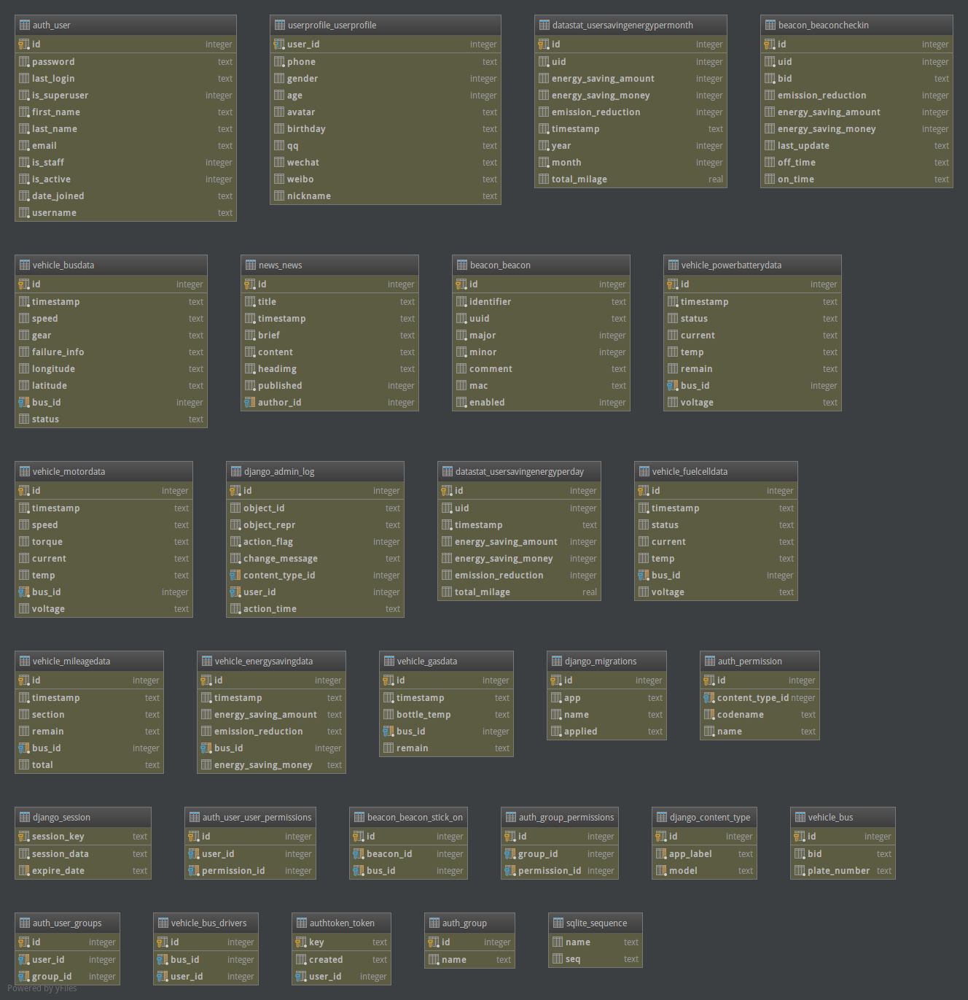

==========
数据库设计
==========

Overview
========

Tables
======

- auth_group
  用户组表
  
- auth_group_permissions
  用户组权限表
  
- auth_permission
  权限表
  
- auth_user
  用户表
  
- auth_user_groups
  用户组表
  
- auth_user_user_permissions
  用户权限关联表
  
- authtoken_token
  认证令牌表
  
- beacon_beacon
  beacon表
  
- beacon_beacon_stick_on
  beacon与车辆关联表
  
- beacon_beaconcheckin
  beacon checkin表
  
- datastat_usersavingenergyperday
  用户节能减排日报表
  
- datastat_usersavingenergypermonth
  用户节能减排月报表
  
- django_admin_log
  admin操作日志表
  
- django_content_type
  admin内容类型表
  
- django_migrations
  数据迁移表
  
- django_session
  session持久化表
  
- news_news
  行业新闻表
  
- userprofile_userprofile
  用户信息表
  
- vehicle_bus
  车辆基本信息表
  
- vehicle_bus_drivers
  车辆司机关联表
  
- vehicle_busdata
  车辆运行信息表
  
- vehicle_energysavingdata
  车辆节能减排表
  
- vehicle_fuelcelldata
  车辆燃料电池信息表
  
- vehicle_gasdata
  车辆氢瓶信息表
  
- vehicle_mileagedata
  车辆里程数据表
  
- vehicle_motordata
  车辆发动机信息表
  
- vehicle_powerbatterydata
  车辆动力电池信息表
